# HRIS - Human Resource Information System

Sistem Informasi Manajemen Sumber Daya Manusia yang lengkap dan modern, dibangun dengan **Next.js 16**, **React 19**, dan **TypeScript**. Aplikasi ini mencakup seluruh siklus HR mulai dari rekrutmen, manajemen karyawan, absensi, penggajian, hingga penilaian kinerja.

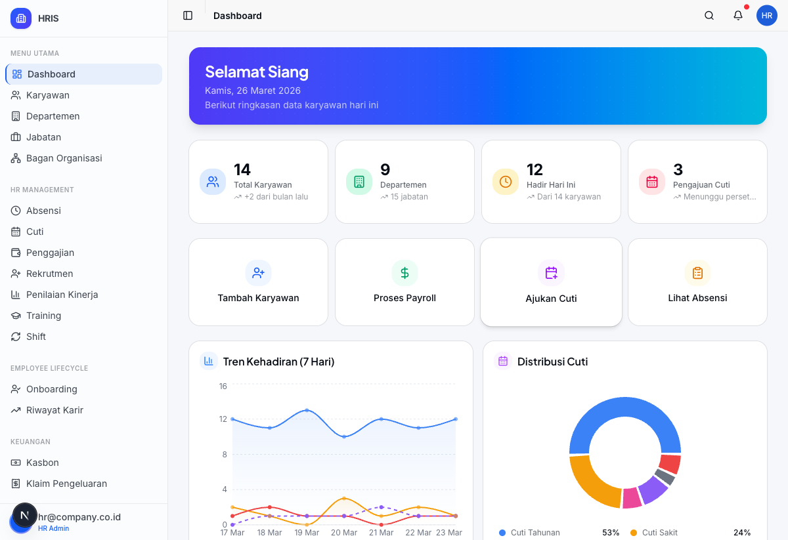

## Highlights

- **33 halaman** fully functional dengan CRUD operations
- **4 role** dengan akses berbeda: Super Admin, HR Admin, Manager, Employee
- **Employee Self-Service (ESS)** — karyawan bisa akses data pribadi secara mandiri
- **Demo mode** — bisa langsung dijalankan tanpa database, data tersimpan di localStorage
- **Modern UI** — Inter + Plus Jakarta Sans fonts, Tailwind CSS 4, responsive design

---

## Daftar Isi

- [Screenshots](#screenshots)
- [Fitur Lengkap](#fitur-lengkap)
- [Tech Stack](#tech-stack)
- [Arsitektur](#arsitektur)
- [Role & Akses](#role--akses)
- [Quick Start](#quick-start)
- [Demo Accounts](#demo-accounts)
- [Struktur Project](#struktur-project)
- [Modul-Modul](#modul-modul)
- [Database Schema](#database-schema)
- [Deployment](#deployment)

---

## Screenshots

### HR Admin Dashboard
Overview perusahaan: total karyawan, departemen, kehadiran, chart tren, kontrak expiring, aktivitas terbaru.


### Employee Dashboard (Self-Service)
Dashboard personal karyawan: sisa cuti, gaji terakhir, penilaian kinerja, training, quick links.

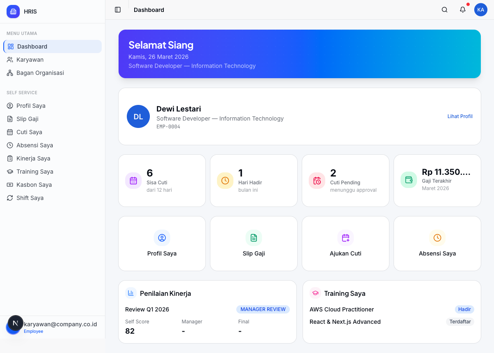

### Manajemen Karyawan
List karyawan dengan search, filter, pagination. CRUD lengkap dengan delete confirmation.

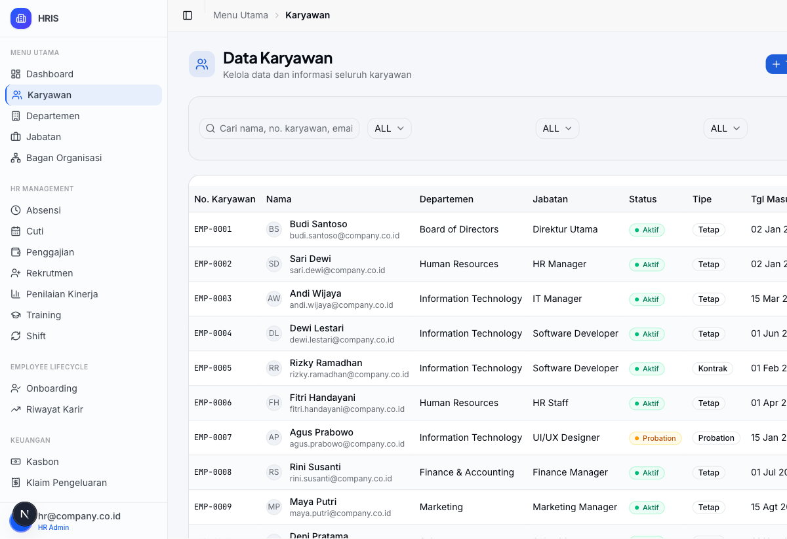

### Edit Karyawan
Form 3-step wizard: Data Pribadi, Kepegawaian, Keuangan & Pajak.

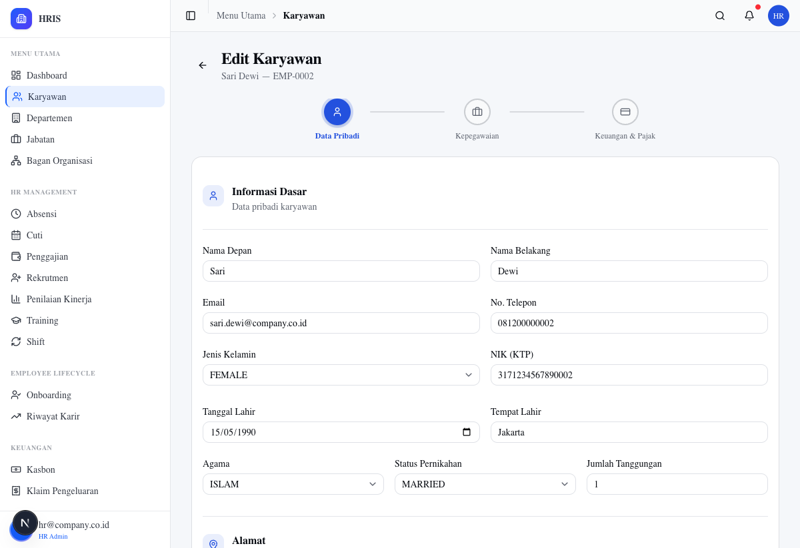

### Manajemen Cuti
Approve/reject pengajuan cuti, saldo cuti per karyawan, kelola tipe cuti.

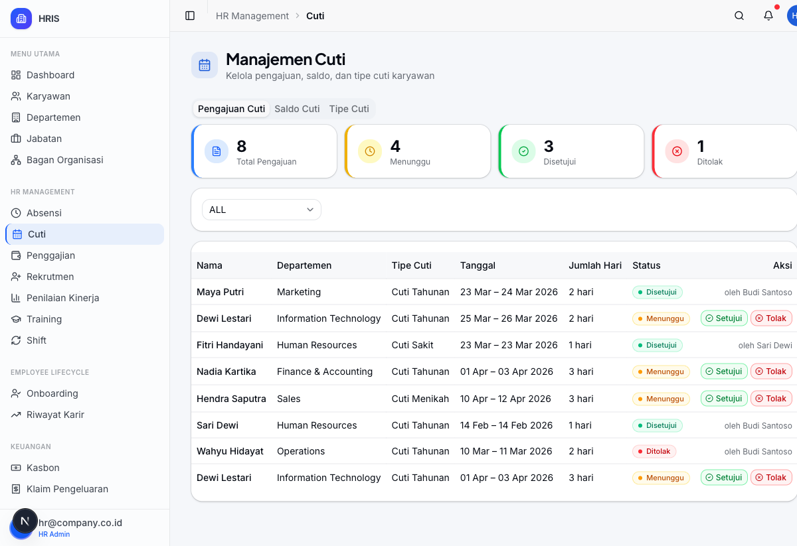

### Penggajian
Periode payroll, slip gaji detail dengan komponen BPJS dan PPh 21.

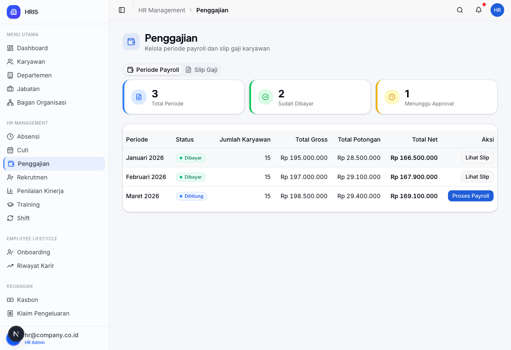

### Rekrutmen
Kelola lowongan kerja, pelamar, pipeline rekrutmen.

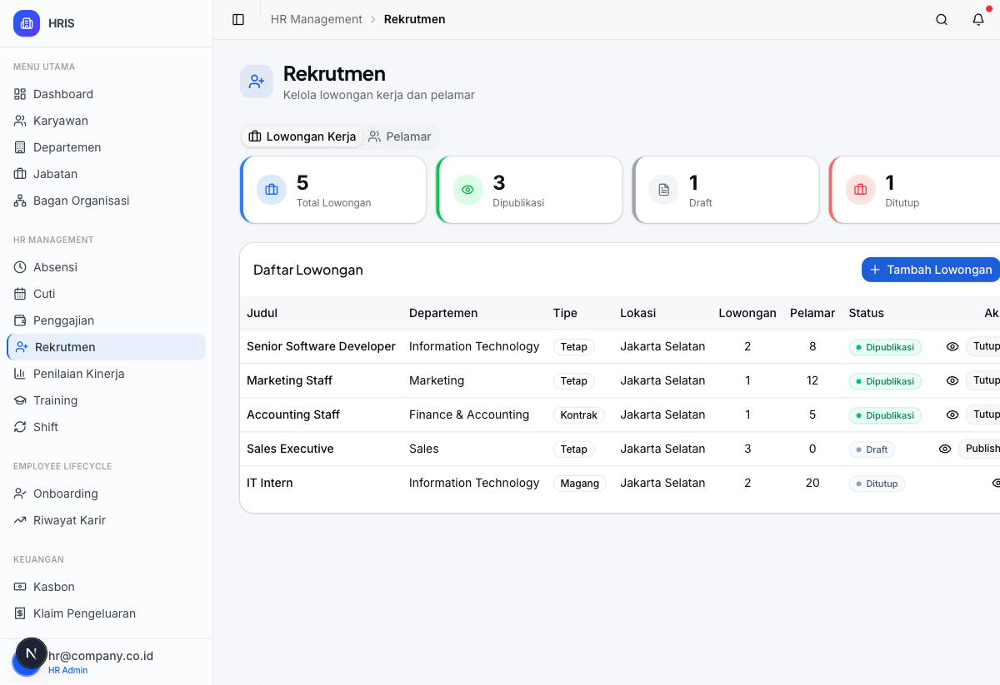

### Absensi
Kehadiran harian, overtime, hari libur.

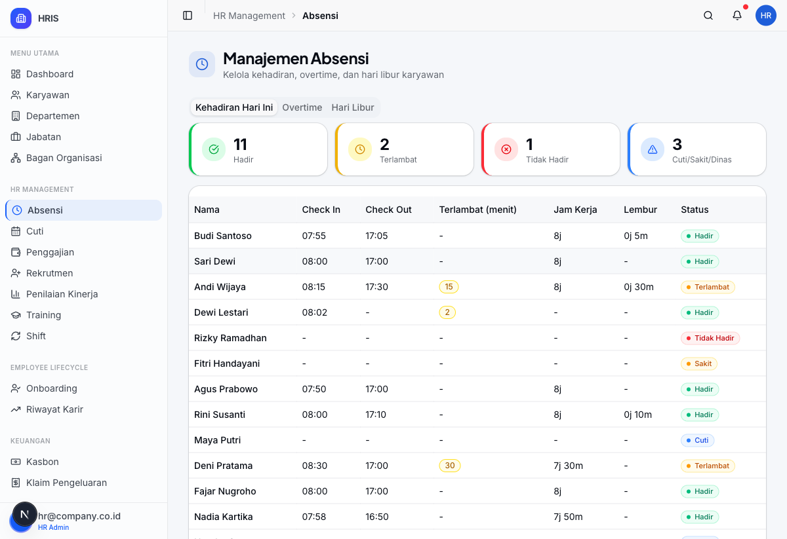

### ESS - Profil Karyawan
Karyawan melihat data pribadi sendiri, terhubung ke session login.

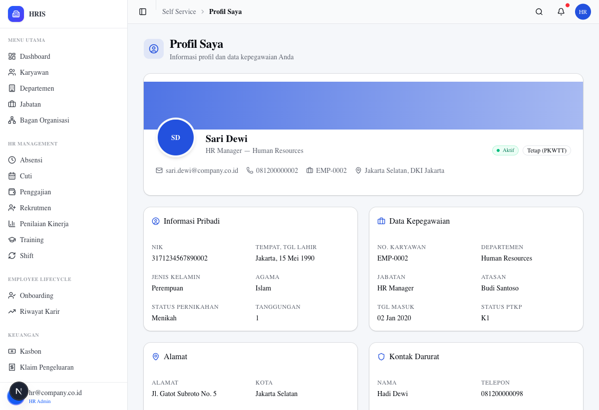

### ESS - Slip Gaji
Karyawan melihat slip gaji sendiri dengan detail potongan.

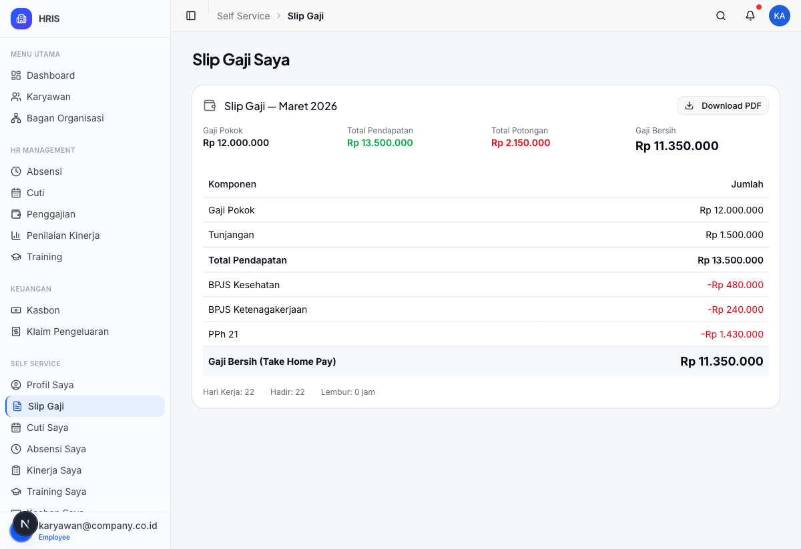

### ESS - Ajukan Cuti
Form pengajuan cuti untuk karyawan.

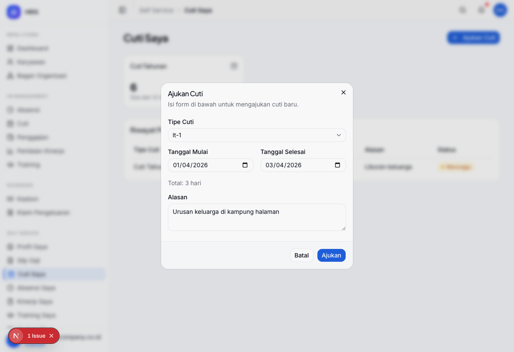

---

## Fitur Lengkap

### Manajemen Karyawan
- CRUD karyawan (50+ field: data pribadi, kepegawaian, keuangan)
- Employee number auto-generate
- Form wizard 3 langkah
- Soft delete dengan konfirmasi
- Search, filter (departemen, status, tipe), pagination

### Organisasi
- Manajemen Departemen (CRUD + delete confirmation)
- Manajemen Jabatan (CRUD + filter by departemen)
- Bagan Organisasi (tree view interaktif)

### Absensi & Kehadiran
- Rekap kehadiran harian (hadir, terlambat, tidak hadir, cuti/sakit)
- Manajemen overtime (pengajuan + approve/reject)
- Hari libur nasional & perusahaan

### Cuti
- 7 tipe cuti (Tahunan, Sakit, Melahirkan, Ayah, Menikah, Duka, Tanpa Bayar)
- Saldo cuti per karyawan
- Workflow approve/reject
- Pengajuan cuti via ESS

### Penggajian
- Periode payroll (bulanan)
- Slip gaji detail: gaji pokok, tunjangan, BPJS Kes, BPJS TK, PPh 21
- Proses payroll (status: Dihitung -> Dibayar)
- Download slip gaji (ESS)

### Penilaian Kinerja
- Review cycle (Quarterly / Annual)
- Self assessment + Manager review
- Score tracking (Self, Manager, Final)
- Status workflow: Draft -> Self Review -> Manager Review -> Completed

### Rekrutmen
- Job posting (Draft, Dipublikasi, Ditutup)
- Manajemen pelamar
- Pipeline interview (HR, Technical, User, Final)
- Status tracking per pelamar

### Training
- Program training (online/offline/hybrid)
- Pendaftaran peserta
- Tracking status (Terdaftar, Hadir, Selesai)
- Sertifikasi

### Employee Lifecycle
- Onboarding (templates + checklist)
- Lifecycle events: Promosi, Transfer, Demosi, Perpanjangan Kontrak, Resign, Terminasi, Pensiun
- Timeline riwayat karir

### Keuangan Karyawan
- Kasbon / Cash Advance (CRUD + approve)
- Klaim Pengeluaran / Expense Claims (CRUD + approve)

### Shift & Jadwal
- Tipe shift (Pagi, Siang, Malam, dll)
- Assignment shift per karyawan
- Roster mingguan

### Employee Self-Service (ESS)
- Profil pribadi (read-only, dari session auth)
- Slip gaji bulanan
- Ajukan cuti (form dialog)
- Rekap absensi pribadi
- Penilaian kinerja (self score)
- Training yang diikuti
- Kasbon pribadi
- Jadwal shift pribadi

### Dashboard
- **Admin Dashboard**: Overview perusahaan (stat cards, charts, kontrak expiring, karyawan per dept, aktivitas terbaru)
- **Employee Dashboard**: Data personal (sisa cuti, gaji terakhir, kinerja, training)

### Keamanan & Akses
- Authentication via Auth.js 5 (NextAuth)
- JWT session strategy
- Role-based access control (4 level)
- Middleware protection (redirect unauthorized)
- Sidebar filtering by role

---

## Tech Stack

| Layer | Teknologi |
|-------|-----------|
| **Framework** | Next.js 16.2.1 (App Router, Turbopack) |
| **UI Library** | React 19.2.4 |
| **Language** | TypeScript 5 |
| **Styling** | Tailwind CSS 4, tw-animate-css |
| **Components** | Base-UI 1.3 + shadcn/ui (hand-built) |
| **Icons** | Lucide React 0.577 |
| **Fonts** | Inter (body), Plus Jakarta Sans (headings), JetBrains Mono (code) |
| **State** | Zustand 5 (60+ CRUD actions, localStorage persistence) |
| **Forms** | React Hook Form 7 + Zod 4 |
| **Tables** | TanStack React Table 8 |
| **Charts** | Recharts 3 |
| **Auth** | Auth.js 5 (NextAuth beta 30) — Credentials + JWT |
| **Database** | Prisma 6.19 + PostgreSQL (optional, demo mode available) |
| **Toast** | Sonner 2 |
| **Date** | date-fns 4 |

---

## Arsitektur

```
Browser (Client)
    |
    v
Next.js App Router (Server Components + Client Components)
    |
    ├── Auth.js 5 (JWT Authentication)
    ├── Middleware (Role-based route protection)
    ├── AuthProvider (Client context: email, role, employeeId)
    |
    v
Zustand Store (Client-side state + localStorage persistence)
    |
    ├── 60+ CRUD actions
    ├── 27 entity collections
    └── Persist middleware (auto-save to localStorage)

Optional:
    └── Prisma ORM → PostgreSQL (production mode)
```

### Data Flow
1. **Login**: Auth.js validates credentials → JWT token → Session
2. **Middleware**: Checks role → Redirect if unauthorized
3. **Layout**: Server component reads session → Passes to AuthProvider
4. **Pages**: Client components read from Zustand store + useAuth()
5. **CRUD**: Store actions update state → Auto-persisted to localStorage

---

## Role & Akses

| Halaman | Employee | Manager | HR Admin | Super Admin |
|---------|:--------:|:-------:|:--------:|:-----------:|
| Dashboard (personal) | ✅ | - | - | - |
| Dashboard (admin) | - | ✅ | ✅ | ✅ |
| ESS (8 halaman) | ✅ | ✅ | ✅ | ✅ |
| Karyawan (read-only) | - | ✅ | ✅ | ✅ |
| Karyawan (CRUD) | - | - | ✅ | ✅ |
| Departemen & Jabatan | - | - | ✅ | ✅ |
| Bagan Organisasi | - | ✅ | ✅ | ✅ |
| Absensi, Cuti, Payroll | - | ✅ | ✅ | ✅ |
| Rekrutmen, Onboarding | - | - | ✅ | ✅ |
| Riwayat Karir | - | - | ✅ | ✅ |
| Penilaian Kinerja | - | ✅ | ✅ | ✅ |
| Training, Shift | - | ✅ | ✅ | ✅ |
| Kasbon, Klaim | - | ✅ | ✅ | ✅ |
| Pengaturan | - | - | - | ✅ |

---

## Quick Start

### Prerequisites
- Node.js 18+
- npm / pnpm / yarn

### Installation

```bash
# Clone repository
git clone https://github.com/Logia-ysn/App-Human-Resources.git
cd App-Human-Resources

# Install dependencies
npm install

# Run development server
npm run dev
```

Buka [http://localhost:3000](http://localhost:3000) di browser.

### Demo Mode (Default)
Aplikasi berjalan dalam **demo mode** — tidak perlu database. Semua data tersimpan di localStorage browser. Gunakan demo accounts di halaman login.

### Production Mode (PostgreSQL)

```bash
# Setup environment
cp .env.example .env
# Edit .env: set DATABASE_URL dan AUTH_SECRET

# Push schema ke database
npm run db:push

# Seed data awal
npm run db:seed

# Build & start
npm run build
npm start
```

---

## Demo Accounts

| Role | Email | Password | Akses |
|------|-------|----------|-------|
| **Super Admin** | admin@company.co.id | admin123 | Full access + Settings |
| **HR Admin** | hr@company.co.id | hr123 | Full HR operations |
| **Manager** | manager@company.co.id | manager123 | View + approve operations |
| **Karyawan** | karyawan@company.co.id | karyawan123 | Dashboard personal + ESS only |

---

## Struktur Project

```
src/
├── app/
│   ├── (auth)/login/              # Halaman login
│   ├── (dashboard)/               # Protected routes
│   │   ├── dashboard/             # Dashboard (admin + employee)
│   │   ├── employees/             # Karyawan (list, detail, new, edit)
│   │   ├── departments/           # Departemen
│   │   ├── positions/             # Jabatan
│   │   ├── attendance/            # Absensi
│   │   ├── leave/                 # Cuti
│   │   ├── payroll/               # Penggajian
│   │   ├── recruitment/           # Rekrutmen
│   │   ├── performance/           # Penilaian Kinerja
│   │   ├── training/              # Training
│   │   ├── onboarding/            # Onboarding
│   │   ├── lifecycle/             # Riwayat Karir
│   │   ├── expenses/              # Kasbon & Klaim
│   │   ├── shifts/                # Shift
│   │   ├── org-chart/             # Bagan Organisasi
│   │   ├── notifications/         # Notifikasi
│   │   ├── settings/              # Pengaturan
│   │   └── ess/                   # Employee Self-Service (8 sub-modules)
│   │       ├── profile/
│   │       ├── payslips/
│   │       ├── leave/
│   │       ├── attendance/
│   │       ├── performance/
│   │       ├── training/
│   │       ├── expenses/
│   │       └── shifts/
│   └── api/auth/                  # Auth.js API routes
├── components/
│   ├── ui/                        # Base components (30+ shadcn/ui)
│   ├── layout/                    # Sidebar, Header
│   ├── providers/                 # AuthProvider context
│   └── shared/                    # DataTable, StatusBadge, etc.
├── lib/
│   ├── auth.ts                    # Auth.js configuration
│   ├── store/app-store.ts         # Zustand store (60+ actions)
│   ├── dummy-data/                # Demo data (18 files)
│   └── utils/                     # Permissions, formatting
├── middleware.ts                   # Route protection
└── prisma/
    ├── schema.prisma              # 50+ models, 29 enums
    └── seed.ts                    # Database seeder
```

---

## Modul-Modul

### 1. Dashboard
- **Admin**: Stat cards (karyawan, dept, hadir, cuti), charts (kehadiran 7 hari, distribusi cuti), kontrak expiring, karyawan per dept, karyawan baru, aktivitas terbaru
- **Employee**: Profil ringkas, sisa cuti, hari hadir, cuti pending, gaji terakhir, penilaian kinerja, training

### 2. Manajemen Karyawan
- List: search, 3 filter (dept/status/tipe), pagination 10/page
- Create: wizard 3 langkah (pribadi, kepegawaian, keuangan)
- Edit: pre-populated form, 3 langkah
- Delete: soft-delete dengan dialog konfirmasi
- Detail: 3 tab (pribadi, kepegawaian, keuangan)

### 3. Absensi
- Tab Kehadiran: stat cards + tabel detail per karyawan
- Tab Overtime: pengajuan lembur + approve/reject
- Tab Hari Libur: kelola libur nasional & perusahaan

### 4. Cuti
- Tab Pengajuan: list + filter status + approve/reject
- Tab Saldo: saldo per karyawan per tipe cuti
- Tab Tipe Cuti: CRUD tipe cuti

### 5. Penggajian
- Tab Periode: list periode + proses payroll
- Tab Slip Gaji: detail per karyawan (gaji pokok, tunjangan, BPJS, PPh 21, THP)

### 6. Rekrutmen
- Tab Lowongan: CRUD + publish/close
- Tab Pelamar: status pipeline + filter

### 7. Employee Self-Service
8 sub-modul yang menampilkan data personal karyawan berdasarkan session auth:
- Profil, Slip Gaji, Cuti (+ ajukan baru), Absensi, Kinerja, Training, Kasbon, Shift

---

## Database Schema

Prisma schema mencakup **50+ model** dan **29 enum**:

**Core**: User, Company, Department, Position, Employee

**HR Operations**: Attendance, OvertimeRequest, LeaveType, LeaveBalance, LeaveRequest, PayrollPeriod, Payslip, SalaryComponent

**Talent**: JobPosting, Applicant, InterviewSchedule, ReviewCycle, PerformanceReview, KpiTemplate, TrainingProgram, TrainingParticipant

**Lifecycle**: OnboardingTemplate, EmployeeOnboarding, LifecycleEvent, Notification

---

## Scripts

```bash
npm run dev           # Development server (Turbopack)
npm run build         # Production build (+ Prisma generate)
npm start             # Production server
npm run lint          # ESLint check
npm run db:push       # Push schema ke PostgreSQL
npm run db:seed       # Seed database
npm run db:studio     # Prisma Studio (GUI)
npm run db:reset      # Reset database
```

---

## Docker

```bash
# Build & run with Docker Compose
docker-compose up -d

# Includes: Next.js app + PostgreSQL database
```

---

## Roadmap

- [ ] User Management Page (admin CRUD, role assignment)
- [ ] Quality Trending / SPC Charts
- [ ] Audit Log Viewer
- [ ] Mobile-Responsive / PWA
- [ ] Dark Mode
- [ ] Export to Excel/PDF
- [ ] Email Notifications
- [ ] REST API for third-party integration

---

## License

MIT

---

**Built with Next.js 16, React 19, TypeScript, Tailwind CSS 4, and Zustand.**
